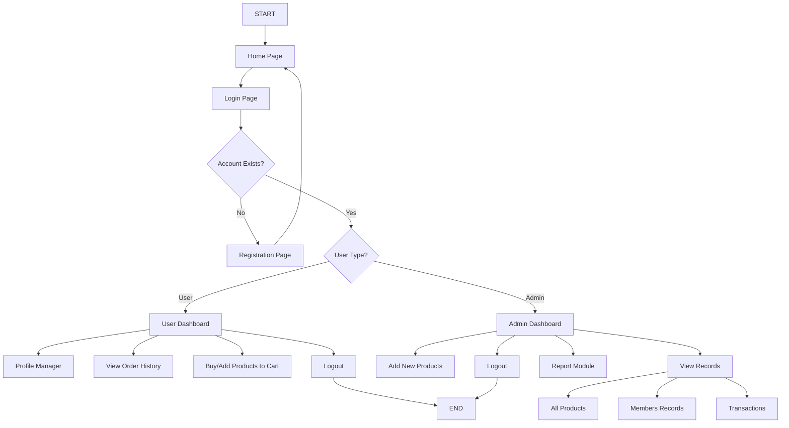
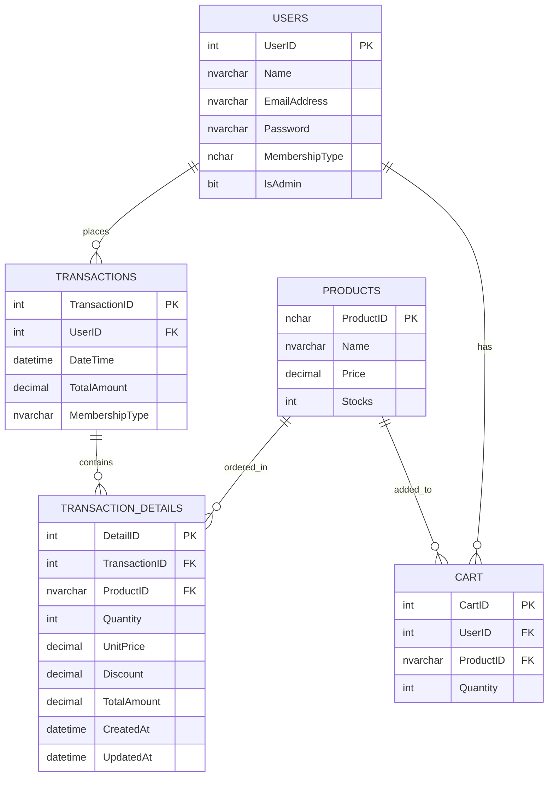
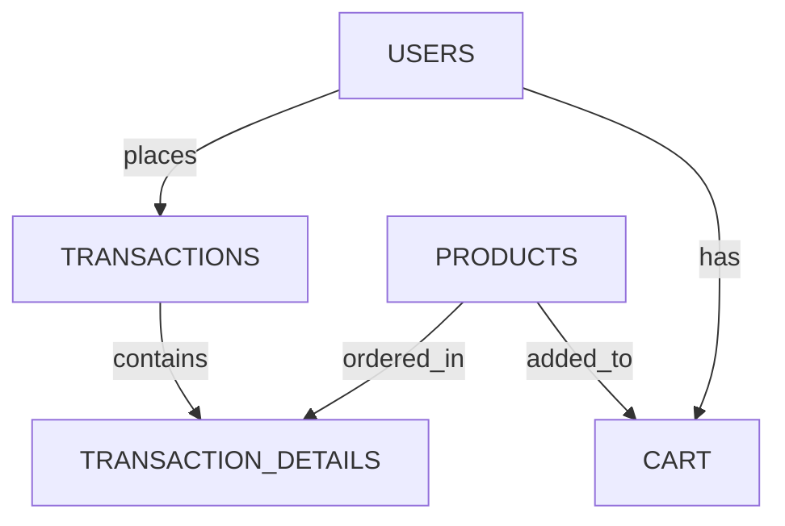

<div align="center">
  <h1>📊 Sales and Inventory System</h1>
  <p><strong>A comprehensive web application for managing product inventory and sales transactions</strong></p>
  
  
  
  
  
  
</div>

## 📑 Table of Contents
- [Project Overview](#-project-overview)
- [System Features](#-system-features)
- [Product Inventory](#-product-inventory)
- [Sales System](#-sales-system)
- [System Flowchart](#-system-flowchart)
- [Installation Guide](#-installation-guide)
- [Troubleshooting](#-troubleshooting)
- [Development Guidelines](#-development-guidelines)
- [Documentation](#-documentation)

## 🔍 Project Overview

This Sales and Inventory System is developed in compliance to our subject ***"Application Development and Emerging Technologies"*** as a case study for companies requiring management of sales transactions and inventory tracking by implementing basic CRUD functions using T-SQL and C# as the backend language. Built using **ASP.NET WebForms** with **ADO.NET** for database operations, the system provides a comprehensive platform for both administrators and users.

The project includes:
- Dual interfaces (Admin and User)
- Basic authentication system
- Product inventory management
- Sales processing with discount calculations
- Comprehensive reporting features
## ✨ System Features

### 🔒 Admin Dashboard
- **Product Management**: Add, edit, and remove products from inventory
- **Transaction Monitoring**: View all completed sales transactions
- **Member Management**: Access and manage user account information
- **Reports Generation**: Generate sales summaries using Microsoft Reporting Services / RDLC
  
### 👤 User Portal
- **Profile Management**: Update & Change password
- **Shopping Cart**: Add products to cart and complete checkout process
- **Order History**: View past purchase transactions
- **Secure Logout**: End session securely

## 🛒 Product Inventory

The system comes pre-loaded with the following inventory:

| ID | Product ID | Product Name        | Base Price | Stocks | SRP (15% markup) |
|----|------------|---------------------|------------|--------|------------------|
| 1  | MSE        | Mouse               | ₱350.00    | 100    | ₱402.50          |
| 2  | PRN        | Printer Ink         | ₱7,500.00  | 100    | ₱8,625.00        |
| 3  | PRNDT      | Printer Dot Matrix  | ₱5,000.00  | 100    | ₱5,750.00        |
| 4  | MNTRLc     | LCD Monitor         | ₱6,500.00  | 100    | ₱7,475.00        |
| 5  | MNTRLe     | LED Monitor         | ₱7,500.00  | 100    | ₱8,625.00        |

## 💵 Sales System

### Transaction Processing

Each transaction is processed through a shopping cart interface:

| Product Name | Price    | Quantity | Amount    |
|--------------|----------|----------|-----------|
| Example Item | ₱999.99  | 2        | ₱1,999.98 |
| **Total**    |          |          | **₱XXX.XX** |

### Pricing Calculations

The system automatically calculates:
- **SRP (Selling Price)** = Base Price + 15% markup
- **VAT** = 10% of Total Amount
- **Total Amount** = (Subtotal + VAT) - Applicable Discount

### Membership Benefits

Customers with membership status receive discounts on purchases totaling **₱10,000.00 or more**:

| Membership Level | Discount Rate | Example (₱10,000 purchase) |
|------------------|---------------|----------------------------|
| Silver           | 5%            | ₱500 discount              |
| Gold             | 10%           | ₱1,000 discount            |
| Platinum         | 15%           | ₱1,500 discount            |

## 🔄 System Flowchart



## 🔄 ER Diagram


## 🔄 ERD Visual Flow


## 🚀 Installation Guide

### Prerequisites
- Visual Studio 2022
- .NET Framework 4.7.2 or higher
- SQL Server / SQL Server Express LocalDB (Optional)(Uses Server Explorer from Visual Studio)

### 1. Clone the Repository

```bash
# Clone via command line
git clone https://github.com/Keonbe/AppDev-FinalActivity3-CaseStudy.git

# Or in Visual Studio
# Git → Clone Repository → https://github.com/Keonbe/AppDev-FinalActivity3-CaseStudy
```

### 2. Database Setup

#### Option 1: Using the OneDrive .mdf File (Recommended)

1. **Clone the Project**
   ```bash
   git clone https://github.com/Keonbe/AppDev-FinalActivity3-CaseStudy.git
   git pull origin main
   ```

2. **Remove Existing `App_Data`**
   * In Solution Explorer, navigate to `App_Data` folder
   * Delete any existing `.mdf` and `.ldf` files

3. **Download the Working `.mdf` File**
   * Download from [OneDrive link](https://dlsudphl-my.sharepoint.com/my?id=%2Fpersonal%2Fbkm0866%5Fdlsud%5Fedu%5Fph%2FDocuments%2FPROG%5FPROGRAM%2DFILES%2FBIT23%2F2ndSem%2FAppDev%2FSample%20Code%2Fshared%2FCaseStudy%5BNEW%20UI%5D%2FFinalActivity3%2FFinalActivity3%5FCaseStudy%2FFinalActivity3%5FCaseStudy%2FApp%5FData&login_hint=BKM0866%40dlsud%2Eedu%2Eph)

4. **Add `.mdf` File to Project**
   * In Visual Studio, right-click on `App_Data` → **Add** → **Existing Item...**
   * Select the downloaded `.mdf` file

5. **Rebuild Solution**
   * **Build** → **Clean Solution**
   * **Build** → **Rebuild Solution**

6. **Run the Project**
   * Hit `F5` or click **Start Debugging**

#### Option 2: Using Database Scripts

If you prefer not to use the shared `.mdf` file, you can set up the database from scratch:

1. Open **SQL Server Management Studio**
2. Create a new local database (e.g., `SalesInvSystemDB`)
3. Execute the SQL scripts in `/DatabaseScripts` folder in this order:
   * `01_CreateTables.sql`
   * `02_InsertSeedData.sql`
   * `03_StoredProcedures.sql` (if applicable)

### 3. Configure Connection String

Add this to your `Web.config` file:

```xml
<connectionStrings>
  <add name="DBMS" 
       connectionString="Data Source=(LocalDB)\MSSQLLocalDB;
                         AttachDbFilename=|DataDirectory|\SalesInvSystemDB.mdf;
                         Integrated Security=True;
                         Connect Timeout=30;" 
       providerName="System.Data.SqlClient" />
</connectionStrings>
```

Then access it in your code:

```csharp
using System.Configuration;

private readonly string connStr = ConfigurationManager.ConnectionStrings["DBMS"].ConnectionString;
```

### 4. Build and Run

1. Clean Solution: **Build → Clean Solution**
2. Rebuild: **Build → Rebuild Solution**
3. Run: Press **F5** or **Debug → Start Debugging**

## 🔧 Troubleshooting

### Database Issues

| Issue | Solution |
|-------|----------|
| **"Conversion failed when converting nvarchar to int"** | Check data types in stored procedures and tables |
| **Stored Procedure returns nothing** | Verify parameters match actual data and check joins |
| **"Cannot open database .mdf"** | Ensure file is properly attached via **Add → Existing Item** |
| **Login failed for user** | Verify `Integrated Security=True` in connection string |
| **Special characters in DB path** | Rename files to avoid `&` and other special characters |

### ASP.NET Issues

| Issue | Solution |
|-------|----------|
| **GridView is blank** | Check `DataSource`, `DataBind()` and timing of data binding |
| **Object reference not set** | Add null checks before accessing controls or data |
| **ASP.NET links giving 404/403** | Use root-relative paths (`~/`) for navigation |
| **Page opens blank with no error** | Check for silently caught exceptions and `IsPostBack` logic |
| **CSS/JS not loading** | Use proper relative paths with `~/Content/` format |

### First-Run "Free Fixes"

#### 1. Roslyn Compiler Missing
```
Could not find a part of the path '…\bin\roslyn\csc.exe'
```
Install/update **Microsoft.CodeDom.Providers.DotNetCompilerPlatform** via NuGet

#### 2. Native SQL Server Types Missing
```
Could not copy '…\SqlServerTypes\x64\SqlServerSpatial140.dll'
```
Install/update **Microsoft.SqlServer.Types** via NuGet

#### 3. 403.14 Forbidden — No Default Document
Right-click `Homepage.aspx` → **Set as Start Page** → F5

## 📝 Development Guidelines

### Pull Request Checklist
1. ✅ **Define** the purpose of your change
2. ✅ **Plan** your implementation approach
3. ✅ **Build in small increments** and test frequently
4. ✅ **Understand** all code (especially AI-generated)
5. ✅ **Use clear naming** for methods and SQL objects
6. ✅ **Document** complex logic with comments
7. ✅ **Test** thoroughly, including edge cases

### Code Style
- Use PascalCase for class names and methods
- Use camelCase for local variables
- Document public methods with XML comments
- Follow the repository's established patterns

### Master Page Reference System

The project uses a structured folder system with master pages in different locations.

```
Root/
├── Admin/
│   ├── AdminMaster.master   ← Admin master page
│   └── Dashboard.aspx
├── User/
│   ├── AdminMaster.master
│   ├── MainMasterpage.Master   ← Primary master page
│   ├── ProductCatalog.aspx
│   └── ShoppingCart.aspx
└── HomePage/
     ├── LandingPage.Master   ← Landing master page
     ├── newRegistration.aspx
     └── newLogin.aspx
```

### Path Reference Rules

1. **Always use `~` for root-relative paths** when crossing folder boundaries
   ```aspnet
   ❌ "MainMasterpage.Master" 
   ✅ "~/User/MainMasterpage.Master"
   ```

2. **Case sensitivity matters**
   ```aspnet
   ❌ "mainmasterpage.master"
   ✅ "MainMasterpage.Master"
   ```

3. **Set correct file properties**:
   - Build Action = Content
   - Copy to Output Directory = Copy if newer

## 📚 Documentation

Additional documentation is available in:
- [DEVELOPER_NOTES.md](DEVELOPER_NOTES.md) - Extended technical documentation
- [/DatabaseScripts/README.md](/DatabaseScripts/README.md) - Database schema details

## 🔄 Collaboration Compatibility Guide

### Comprehensive list of collaboration compatibility issues:

#### 1️⃣ **Codebase Issues**
- **RDLC Reports Not Rendering**  
  Missing files, dataset name mismatches, or missing `Microsoft.ReportViewer.WebForms`
- **.csproj Conflicts**  
  Version mismatches or path issues causing merge conflicts
- **NuGet Inconsistencies**  
  Package version mismatches or missing restores

#### 2️⃣ **Environment Issues**
- **SQL Server Differences**  
  Missing databases or stored procedures
- **Report Viewer Not Installed**  
  Requires NuGet package:  
  ```bash
  Install-Package Microsoft.Reporting.WebForms
  ```
- **IIS/.NET Version Conflicts**  
  Ensure all use same target framework (check `.csproj`)

#### 3️⃣ **Tooling Issues**
- **Visual Studio Version Conflicts**  
  Solution file compatibility between VS2017/2019/2022
- **Git Line Ending Conflicts**  
  Set `.gitattributes` for consistent line endings

#### 4️⃣ **Workflow Issues**
- **Merge Conflicts**  
  Always pull before pushing changes
- **Untracked Files**  
  Regularly check `git status` for missing files
- **Missing Documentation**  
  Keep `README.md` updated with setup instructions

#### ✅ **Compatibility Checklist**
| Requirement               | Status  | Notes                          |
|---------------------------|---------|--------------------------------|
| Proper `.gitignore`       | ✔️      | Excludes binaries/user files   |
| Updated `README.md`       | ✔️      | Contains setup instructions    |
| NuGet packages restored   | ✔️      | Via `packages.config`          |
| Consistent .NET version   | ✔️ 4.8  | Verified in `.csproj`          |
| SQL scripts available     | ✔️      | In `DatabaseScripts/` folder   |
| ReportViewer installed    | ✔️      | Via NuGet package             |

---

<div align="center">
  <p>Developed by Keanu Bembo and Group | De La Salle University – Dasmariñas</p>
  <p>Final Exam Project for Application Development 2025</p>
</div>
